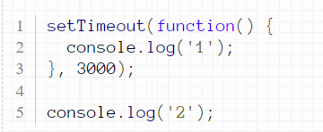

# sinxronicod
# sinxronicod

    # Что такое синхронный код?
## Выполнение JS-кода — однопоточное. Это значит, что в конкретный момент времени движок может выполнять не более одной строки кода. То есть вторая строка не будет выполнена, пока не выполнится первая. Такое выполнение кода (строка за строкой) называется синхронным
# Пример 

+ Очевидно, что сначала сработает первый вывод в консоль, а потом - второй. То есть команды нашего кода выполняются по очереди - в порядке их следования в коде. Такой код называется синхронным.
# Что такое асинхронный код?
## Асинхронное программирование — это подход к написанию кода, при котором несколько задач выполняются параллельно и независимо друг от друга (в отличие от синхронного программирования, где каждая операция выполняется последовательно и синхронно).
# Пример 

+ В данном случае команды не выполняются в порядке следования в коде: первый вывод в консоль выполнится, когда приходит его время, но остальной код не ожидает этого момента, а продолжает выполнятся. Такой код называется асинхронным.
+ Асинхронный код возникает в JavaScript достаточно часто: при работе с таймерами, при привязке обработчиков событий, при загрузке картинок, при работе с технологией AJAX, позволяющей загружать части страницы с сервера, при работе с NodeJS, представляющим собой серверный JavaScript.

# Способы создания асинхронного кода
## 1. С помощью callback
## 2. С помощью Promise
## 3. С помощью async/await

# 1. Callback

# Callback (функция обратного вызова) — это функция, которая передается внутри другой функции, а затем вызывается в этой функции для выполнения задачи.
# Пример 

console.log('fired first');
console.log('fired second');

setTimeout(()=>{
    console.log('fired third');
},2000);

console.log('fired last');
+ Приведенный выше фрагмент представляет собой небольшую программу, которая выводит данные в консоли. Но здесь есть что-то новое. Интерпретатор выполнит первую инструкцию, затем вторую, но пропустит третью и выполнит последнюю.
### setTimeout — это функция JavaScript, которая принимает два параметра.
### Первый параметр — это другая функция,
### а второй — время, по истечении которого эта функция должна выполняться в миллисекундах.

# Что такое обещания (promises) в JavaScript?

## Promise в нашем контексте — это то, что требует некоторого времени для выполнения. Есть два возможных результата обещания:

## Мы либо запускаем и разрешаем (resolve) promise, либо
## В строке происходит какая-то ошибка, и обещание отклоняется (reject)
## Появились promises, чтобы решить проблемы функций обратного вызова.
# Promise принимает две функции в качестве параметров:
# 1.resolve() — это успех.
# 2.reject() — при возникновении ошибки.

const getData = (dataEndpoint) => {
   return new Promise ((resolve, reject) => {
     //some request to the endpoint;
     
     if(request is successful){
       //do something;
       resolve();
     }
     else if(there is an error){
       reject();
     }
   
   });
};
## Приведенный выше код представляет собой promise, заключенный в запрос к некоторому endpoint. Обещание вступает в силу в момент выполнения resolve() или reject().

### Например, после вызова endpoint, если запрос будет успешным, мы разрешим обещание и продолжим делать с ответом все, что захотим. Но если есть ошибка, обещание будет отклонено.

## Промисы — это удобный способ исправить проблемы, вызванные адом обратных вызовов, в методе, известном как цепочка промисов. Вы можете использовать этот метод для последовательного получения данных из нескольких конечных точек, но с меньшим количеством кода и более простыми методами.

## Но есть еще лучший способ! Возможно, вам знаком следующий метод, так как это предпочтительный способ обработки данных и вызовов API в JavaScript.

# Что такое Async и Await в JavaScript?
# Дело в том, что объединение обещаний вместе, как и обратных вызовов, может стать довольно громоздким и запутанным.

# Вот почему были созданы Async и Await.

# Пример 
const asyncFunc = async () => {
  const response = await fetch(resource);
     const data = await response.json();
}
## Ключевое слово async — это то, что мы используем для определения асинхронных функций.

## Но как насчет await? Await останавливает JavaScript от назначения fetch переменной ответа до тех пор, пока обещание не будет разрешено. Как только обещание было разрешено, результаты метода выборки теперь могут быть назначены переменной ответа.

## То же самое происходит в строке 3: Метод json возвращает обещание и мы можем использовать await все еще, чтобы отложить назначение до тех пор, пока обещание не будет разрешено.